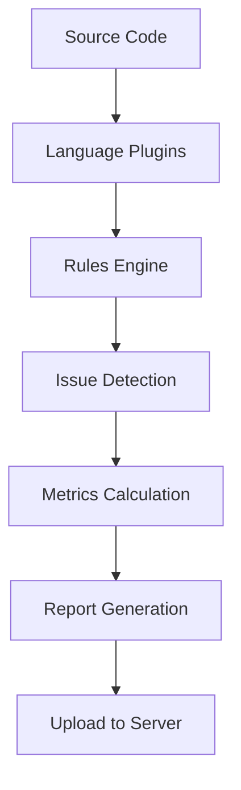

# SonarQube Architecture

## System Overview

SonarQube follows a client-server architecture with three main components working together to provide comprehensive code quality analysis.

```
┌─────────────────────────────────────────────────────────────────┐
│                    SonarQube Ecosystem                         │
├─────────────────────────────────────────────────────────────────┤
│                                                                 │
│  ┌─────────────┐      ┌─────────────┐      ┌─────────────┐    │
│  │   Scanner   │ ───▶ │   Server    │ ───▶ │  Database   │    │
│  │             │      │             │      │             │    │
│  │ • Analysis  │      │ • Web UI    │      │ • Issues    │    │
│  │ • Rules     │      │ • API       │      │ • Metrics   │    │
│  │ • Sensors   │      │ • Compute   │      │ • Config    │    │
│  └─────────────┘      └─────────────┘      └─────────────┘    │
│                                                                 │
│  ┌─────────────────────────────────────────────────────────┐    │
│  │              IDE Integration (SonarLint)               │    │
│  └─────────────────────────────────────────────────────────┘    │
└─────────────────────────────────────────────────────────────────┘
```

## Core Components

### 1. 🔍 SonarQube Scanner

The scanner is responsible for analyzing source code and sending results to the server.

#### Scanner Types:
- **SonarScanner**: Generic scanner for any language
- **SonarScanner for Maven**: Java projects using Maven
- **SonarScanner for Gradle**: Java projects using Gradle
- **SonarScanner for .NET**: C# and VB.NET projects
- **SonarScanner for Jenkins**: CI/CD integration

#### Analysis Process:


### 2. 🖥️ SonarQube Server

The server processes analysis reports and provides the web interface.

#### Server Components:

```
SonarQube Server
├── Web Server (Port 9000)
│   ├── User Interface
│   ├── REST API
│   └── Authentication
├── Compute Engine
│   ├── Background Tasks
│   ├── Report Processing
│   └── Quality Gate Evaluation
└── Elasticsearch (Embedded)
    ├── Issue Indexing
    ├── Rule Storage
    └── Search Functionality
```

### 3. 🗄️ Database Layer

SonarQube supports multiple database systems for persistent storage.

#### Supported Databases:
- **PostgreSQL** (Recommended)
- **Microsoft SQL Server**
- **Oracle Database**

#### Data Storage:
```sql
-- Simplified schema overview
Projects
├── Issues (bugs, vulnerabilities, code smells)
├── Measures (metrics, coverage, duplication)
├── Rules (quality rules and configurations)
├── Quality Gates (pass/fail criteria)
├── Users & Permissions
└── Analysis History
```

## Detailed Component Architecture

### Scanner Architecture

```java
// Scanner workflow (simplified)
public class SonarScanner {
    
    public void analyze(Project project) {
        // 1. Initialize scanner environment
        ScannerContext context = initializeContext();
        
        // 2. Load project configuration
        ProjectConfiguration config = loadConfiguration(project);
        
        // 3. Discover source files
        FileSystem fileSystem = scanFileSystem(project);
        
        // 4. Execute language sensors
        executeSensors(fileSystem, context);
        
        // 5. Apply quality rules
        IssueCollection issues = applyRules(context);
        
        // 6. Calculate metrics
        MeasureCollection measures = calculateMetrics(context);
        
        // 7. Generate and upload report
        Report report = generateReport(issues, measures);
        uploadReport(report);
    }
    
    private void executeSensors(FileSystem fs, ScannerContext context) {
        // Language-specific analysis
        JavaSensor javaSensor = new JavaSensor();
        JavaScriptSensor jsSensor = new JavaScriptSensor();
        PythonSensor pythonSensor = new PythonSensor();
        
        for (File file : fs.getSourceFiles()) {
            if (file.getLanguage() == Language.JAVA) {
                javaSensor.analyze(file, context);
            }
            // ... other languages
        }
    }
}
```

### Server-Side Processing

```python
# Server-side report processing
class ComputeEngine:
    def process_analysis_report(self, report):
        """Process uploaded analysis report"""
        
        # 1. Validate report format
        self.validate_report(report)
        
        # 2. Extract issues and metrics
        issues = self.extract_issues(report)
        metrics = self.extract_metrics(report)
        
        # 3. Store in database
        self.store_issues(issues)
        self.store_metrics(metrics)
        
        # 4. Index for search
        self.elasticsearch.index_issues(issues)
        
        # 5. Evaluate quality gates
        gate_status = self.evaluate_quality_gates(metrics)
        
        # 6. Update project status
        self.update_project_status(gate_status)
        
        # 7. Trigger notifications
        if gate_status.failed():
            self.notification_service.send_alerts()
```

## Analysis Flow

### Complete Analysis Workflow

```
┌─────────────────┐
│   Developer     │
│   Commits Code  │
└─────────┬───────┘
          │
          ▼
┌─────────────────┐    ┌──────────────────┐    ┌─────────────────┐
│   CI/CD System  │───▶│  SonarScanner    │───▶│  Source Code    │
│                 │    │                  │    │  Analysis       │
│ • Jenkins       │    │ • File Discovery │    │                 │
│ • GitLab CI     │    │ • Language Parse │    │ • Syntax Parse  │
│ • GitHub Actions│    │ • Rule Execution │    │ • Issue Detect  │
└─────────────────┘    └──────────────────┘    └─────────────────┘
          │                       │                       │
          │                       │                       ▼
          │                       │            ┌─────────────────┐
          │                       │            │  Analysis       │
          │                       │            │  Report         │
          │                       │            │                 │
          │                       │            │ • Issues List   │
          │                       │            │ • Metrics Data  │
          │                       │            │ • Coverage Info │
          │                       └───────────▶│ • Duplications  │
          │                                    └─────────────────┘
          │                                             │
          ▼                                             ▼
┌─────────────────┐    ┌──────────────────┐    ┌─────────────────┐
│  Quality Gate   │◀───│  SonarQube       │◀───│  Report         │
│  Evaluation     │    │  Server          │    │  Processing     │
│                 │    │                  │    │                 │
│ • Metrics Check │    │ • Web Interface  │    │ • Data Storage  │
│ • Pass/Fail     │    │ • REST API       │    │ • Indexing      │
│ • Notifications │    │ • User Mgmt      │    │ • Calculation   │
└─────────────────┘    └──────────────────┘    └─────────────────┘
```

## Language Plugins Architecture

### How Language Support Works

```javascript
// Example: JavaScript language plugin structure
class JavaScriptPlugin {
    constructor() {
        this.sensors = [
            new EslintSensor(),
            new TypeScriptSensor(), 
            new CoverageSensor(),
            new DuplicationSensor()
        ];
        
        this.rules = new JavaScriptRuleRepository();
        this.filePredicates = ['.js', '.jsx', '.ts', '.tsx'];
    }
    
    analyze(inputFile, context) {
        // Parse JavaScript/TypeScript
        const ast = this.parseFile(inputFile);
        
        // Apply rules
        const issues = this.rules.check(ast);
        
        // Calculate metrics
        const metrics = this.calculateMetrics(ast);
        
        // Save results
        context.saveIssues(issues);
        context.saveMeasures(metrics);
    }
    
    calculateMetrics(ast) {
        return {
            linesOfCode: this.countLines(ast),
            complexity: this.calculateComplexity(ast),
            functions: this.countFunctions(ast),
            classes: this.countClasses(ast)
        };
    }
}
```

## Quality Gates Engine

### Quality Gate Evaluation Process

```csharp
// Quality gate evaluation logic
public class QualityGateEngine
{
    public QualityGateResult Evaluate(ProjectMetrics metrics, QualityGate gate)
    {
        var results = new List<ConditionResult>();
        
        foreach (var condition in gate.Conditions)
        {
            var result = EvaluateCondition(condition, metrics);
            results.Add(result);
        }
        
        return new QualityGateResult
        {
            Status = results.Any(r => r.Status == Status.Failed) 
                ? Status.Failed 
                : Status.Passed,
            ConditionResults = results,
            EvaluatedAt = DateTime.UtcNow
        };
    }
    
    private ConditionResult EvaluateCondition(Condition condition, ProjectMetrics metrics)
    {
        var actualValue = metrics.GetValue(condition.MetricKey);
        var threshold = condition.Threshold;
        
        return condition.Operator switch
        {
            Operator.GreaterThan => actualValue > threshold 
                ? ConditionResult.Failed(actualValue, threshold)
                : ConditionResult.Passed(actualValue, threshold),
                
            Operator.LessThan => actualValue < threshold 
                ? ConditionResult.Passed(actualValue, threshold)
                : ConditionResult.Failed(actualValue, threshold),
                
            _ => throw new NotSupportedException($"Operator {condition.Operator} not supported")
        };
    }
}
```

## Performance Considerations

### Scaling Architecture

```yaml
# Production deployment architecture
version: '3.8'
services:
  sonarqube:
    image: sonarqube:lts
    environment:
      - SONAR_JDBC_URL=jdbc:postgresql://db:5432/sonar
      - SONAR_JDBC_USERNAME=sonar
      - SONAR_JDBC_PASSWORD=sonar
    volumes:
      - sonarqube_data:/opt/sonarqube/data
      - sonarqube_logs:/opt/sonarqube/logs
      - sonarqube_extensions:/opt/sonarqube/extensions
    ports:
      - "9000:9000"
    depends_on:
      - db
    deploy:
      resources:
        limits:
          memory: 4G
        reservations:
          memory: 2G

  db:
    image: postgres:13
    environment:
      - POSTGRES_USER=sonar
      - POSTGRES_PASSWORD=sonar
      - POSTGRES_DB=sonar
    volumes:
      - postgresql_data:/var/lib/postgresql/data
    deploy:
      resources:
        limits:
          memory: 2G
        reservations:
          memory: 1G

volumes:
  sonarqube_data:
  sonarqube_logs:
  sonarqube_extensions:
  postgresql_data:
```

### Performance Optimization

| Component | Optimization | Impact |
|-----------|--------------|--------|
| Scanner | Incremental analysis | 50-80% faster |
| Server | Connection pooling | 30% better throughput |
| Database | Proper indexing | 2x faster queries |
| Elasticsearch | Memory allocation | Faster search |

## Security Architecture

### Authentication & Authorization Flow

```
User Request
     │
     ▼
┌─────────────┐    ┌─────────────┐    ┌─────────────┐
│  Web Filter │───▶│  Auth       │───▶│  Permission │
│             │    │  Provider   │    │  Validator  │
│ • HTTPS     │    │             │    │             │
│ • CSRF      │    │ • LDAP      │    │ • Projects  │
│ • Session   │    │ • SAML      │    │ • Global    │
└─────────────┘    │ • Database  │    │ • Groups    │
                   └─────────────┘    └─────────────┘
                          │                   │
                          ▼                   ▼
                   ┌─────────────┐    ┌─────────────┐
                   │   User      │    │  Resource   │
                   │   Context   │    │  Access     │
                   └─────────────┘    └─────────────┘
```

## Next Steps

Now that you understand SonarQube's architecture, let's explore the [Key Concepts](04-key-concepts.md) that you'll encounter when using the platform.

---

## 🔧 Architecture Exercises

1. **Design Exercise**: Sketch how you would integrate SonarQube into your current CI/CD pipeline
2. **Scaling Exercise**: Plan a SonarQube deployment for a 100-developer team
3. **Security Exercise**: Design authentication flow for your organization

## 📚 Additional Resources

- [SonarQube Official Architecture Documentation](https://docs.sonarqube.org/latest/architecture/)
- [Performance Tuning Guide](https://docs.sonarqube.org/latest/instance-administration/system-requirements/)
- [Plugin Development Guide](https://docs.sonarqube.org/latest/extend/developing-plugin/)